# My Personal Website

Welcome to the open-source repository for my personal website, [https://sarria.ca](https://sarria.ca). 
This project showcases a modern web development stack featuring Next.js, Tailwind CSS, Material-UI components and more!

## ShowCase

<div align="center">
  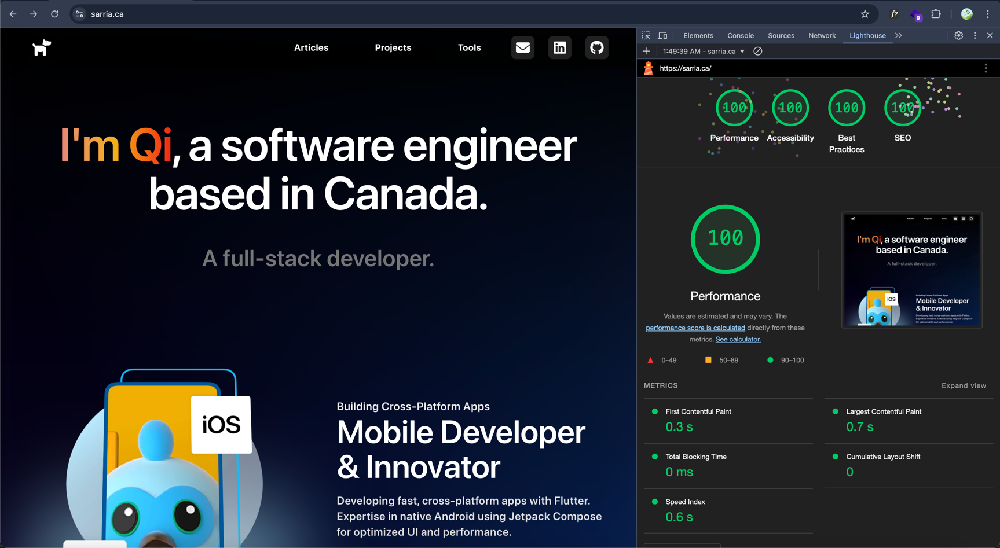
</div>

### Exceptional Web Performance Metrics and SEO
- Excellent page load speed and responsiveness
- High standards for inclusive design and usability for all users
- Adherence to current web development best practices and standards
- Optimal configuration for search engine discoverability and ranking

<div align="center">
  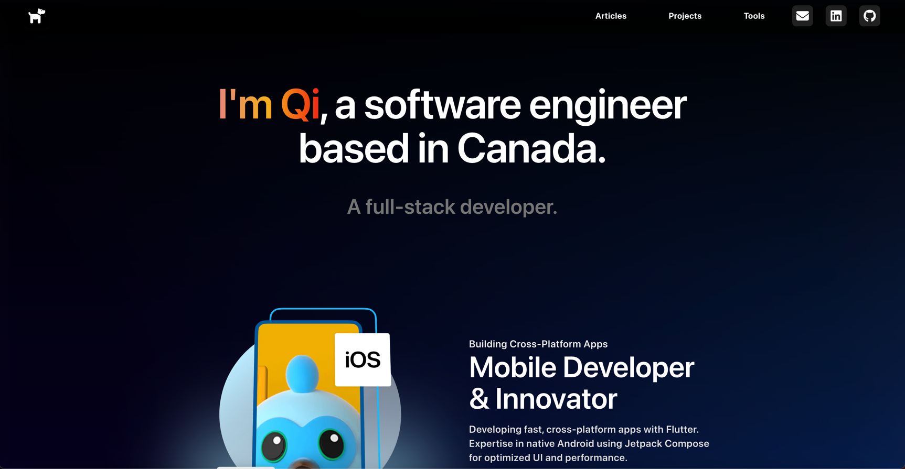
  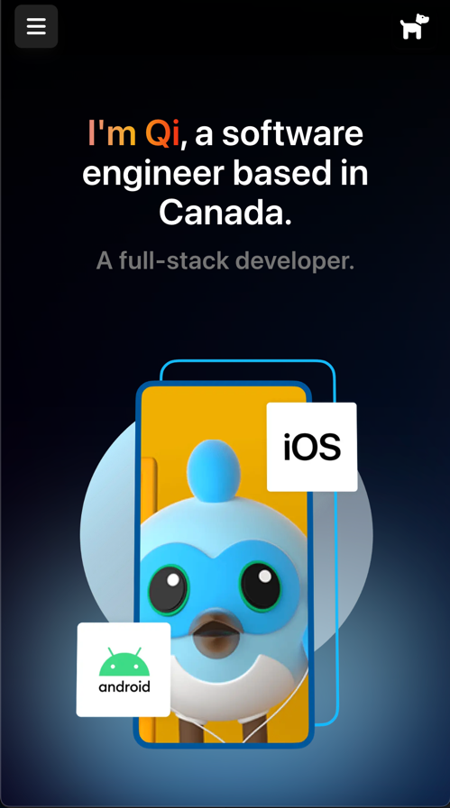
</div>

####

<div align="center">
  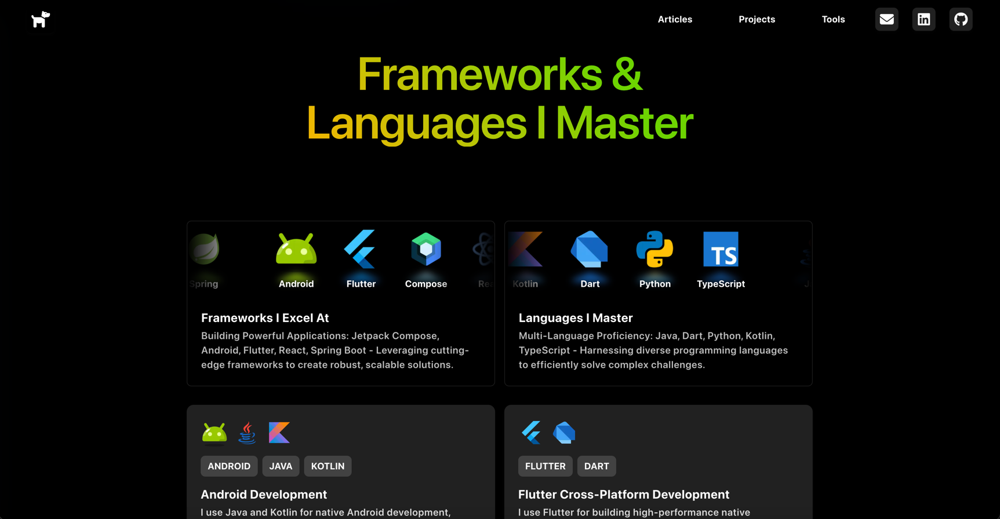
  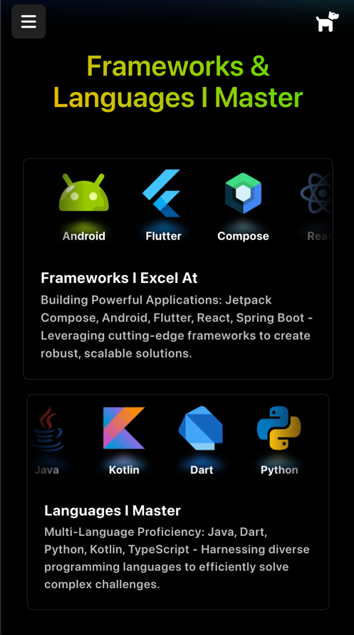
</div>

####

<div align="center">
  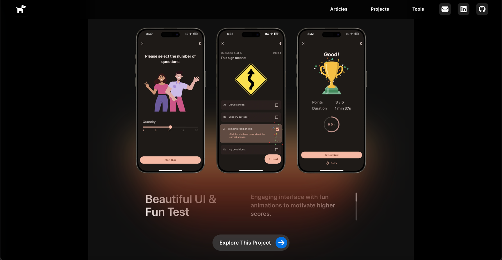
  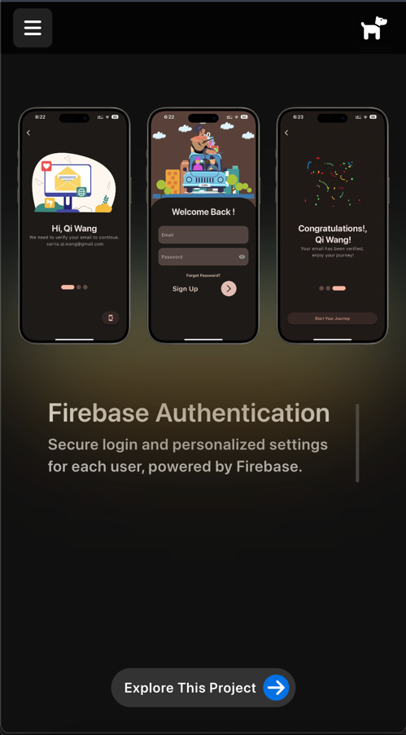
</div>

####

<div align="center">
  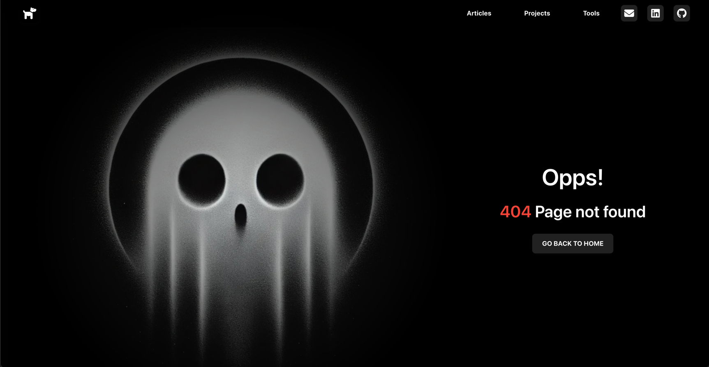
  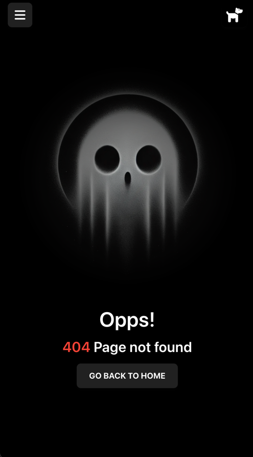
</div>

####

<div align="center">
  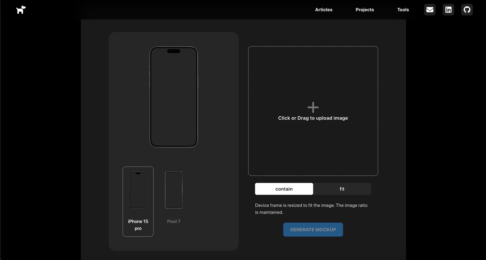
  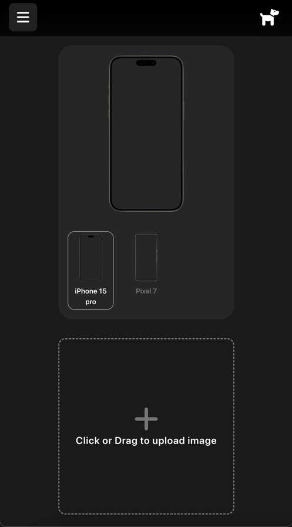
</div>

- My website features an elegant design with dynamic scrolling effects and a responsive layout. It provides a comprehensive introduction to my professional profile.
- The dynamic scrolling effect enhances user engagement, allowing visitors to smoothly navigate through my skills, tech stack, and project highlights. The responsive design ensures optimal viewing across all devices, from desktop to mobile.

## Technologies

- **Next.js**: A React framework for building server-side rendered and statically generated web applications.
- **Tailwind CSS**: A utility-first CSS framework for rapid UI development.
- **Material-UI**: A popular React UI framework that implements Google's Material Design.
- **Framer Motion**: A library for creating smooth, powerful animations in React.
- **TypeScript**: A statically typed superset of JavaScript.

## Installation

To get started with the project, follow these steps:

1. **Clone the repository**:
   ```bash
   git clone https://github.com/SarriaXD/blog_site.git
   cd blog_site
   pnpm install
   pnpm dev
    ```